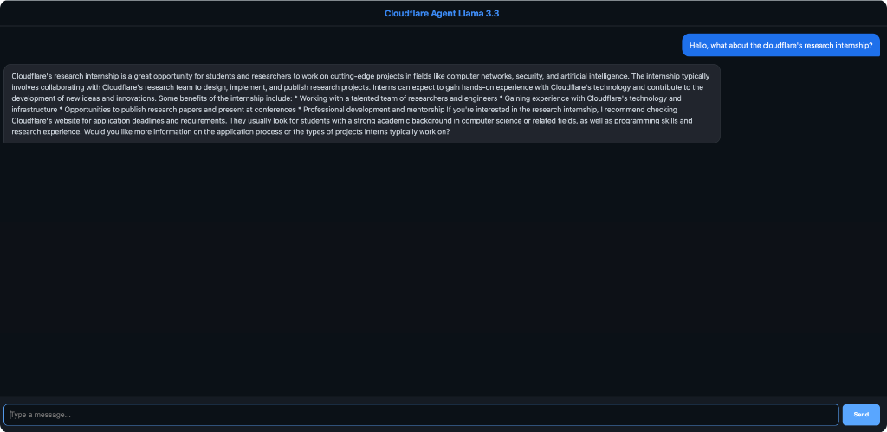

# 🤖 cf_ai_agent_chat

A real-time conversational AI application built on Cloudflare Workers, demonstrating the full capabilities of the Cloudflare developer platform.

## 📋 Assignment Requirements Checklist

| Requirement | Implementation |
|-------------|---------------|
| ✅ **LLM** | Llama 3.3 70B via Workers AI (`@cf/meta/llama-3.3-70b-instruct-fp8-fast`) |
| ✅ **Workflow/Coordination** | Durable Objects for request handling and state coordination |
| ✅ **User Input** | Interactive chat UI served directly from the Worker |
| ✅ **Memory/State** | SQLite storage in Durable Objects for persistent conversation history |

## ✨ Features

- **🧠 Llama 3.3 70B** — State-of-the-art open LLM with excellent instruction following
- **💾 Persistent Memory** — Full conversation history stored in Durable Object SQLite
- **⚡ Edge-First** — Runs on Cloudflare's global network with minimal latency
- **🎨 Premium Dark UI** — Modern chat interface with animations and gradient styling
- **📦 Single-File Deploy** — Entire app in one TypeScript file

## 💬 Use Case

Here's the chat interface in action, asking about Cloudflare's research internship:



## 🏗️ Architecture

```
┌─────────────────────────────────────────────────────────────┐
│                    Cloudflare Edge                          │
│  ┌─────────────┐    ┌──────────────┐    ┌───────────────┐  │
│  │   Worker    │───▶│ Durable      │───▶│  Workers AI   │  │
│  │  (Router)   │    │ Object       │    │  (Llama 3.3)  │  │
│  └─────────────┘    │ (ChatAgent)  │    └───────────────┘  │
│        │            │  ┌────────┐  │                        │
│        │            │  │ SQLite │  │                        │
│        ▼            │  └────────┘  │                        │
│  ┌─────────────┐    └──────────────┘                        │
│  │  Static UI  │                                            │
│  │   (HTML)    │                                            │
│  └─────────────┘                                            │
└─────────────────────────────────────────────────────────────┘
```

## 🚀 Getting Started

### Prerequisites

- **Node.js 18+** installed
- **Cloudflare account** with Workers AI access

### Option 1: Run Locally

```bash
# 1. Clone the repository
git clone https://github.com/Drscq/cf_ai_agent_chat.git
cd cf_ai_agent_chat

# 2. Install dependencies
npm install

# 3. Login to Cloudflare (required for Workers AI)
npx wrangler login

# 4. Start local development server
npm run dev
```

Open **http://localhost:8787** in your browser and start chatting!

> **Note:** Workers AI requires authentication even in local development as it makes real API calls to Cloudflare.

### Option 2: Deploy to Cloudflare

```bash
# Deploy to production
npm run deploy
```

After deployment, you'll receive a URL like `https://agents-starter.<your-subdomain>.workers.dev`.

## 📁 Project Structure

```
cf_ai_agent_chat/
├── src/
│   └── index.ts        # Worker + Durable Object + embedded UI
├── wrangler.jsonc      # Cloudflare bindings configuration
├── package.json        # Dependencies and scripts
├── tsconfig.json       # TypeScript configuration
├── PROMPTS.md          # AI prompts used during development
└── README.md           # This file
```

## 🔧 Technical Implementation

### Durable Object (ChatAgent)

The `ChatAgent` class manages conversation state:

```typescript
export class ChatAgent implements DurableObject {
    private sql: SqlStorage;
    
    async chat(message: string): Promise<string> {
        // 1. Save user message to SQLite
        // 2. Retrieve full conversation history
        // 3. Call Llama 3.3 with context
        // 4. Save AI response
        // 5. Return response
    }
}
```

### State Persistence

SQLite schema for conversation history:
```sql
CREATE TABLE history (
    id INTEGER PRIMARY KEY AUTOINCREMENT,
    role TEXT,        -- 'user' or 'assistant'
    content TEXT,     -- message content
    timestamp INTEGER -- Unix timestamp
)
```

### Worker Routing

```typescript
export default {
    async fetch(request: Request, env: Env) {
        // GET / → Serve chat UI
        // POST /api/chat → Forward to Durable Object
    }
}
```

## 🎯 Design Decisions

| Decision | Rationale |
|----------|-----------|
| **Durable Objects over KV** | Need transactional state updates for conversation history |
| **Embedded Frontend** | Single deployment, no separate build step, edge caching |
| **SQLite Storage** | Native DO storage with ACID guarantees |
| **Llama 3.3 70B FP8** | Best balance of quality and inference speed on Workers AI |

## 📜 License

MIT

---

Built with ❤️ on Cloudflare Workers
